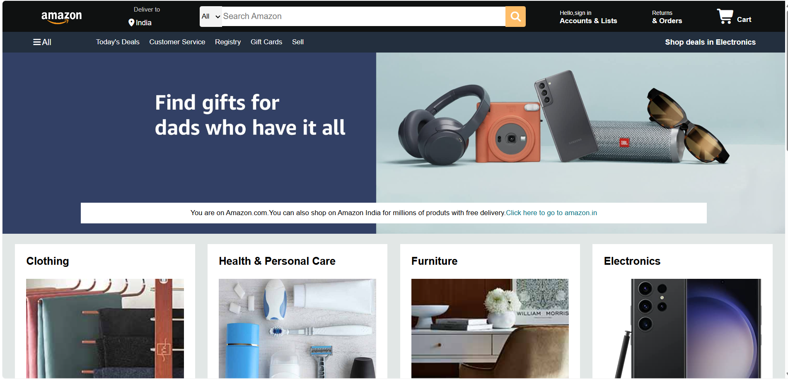
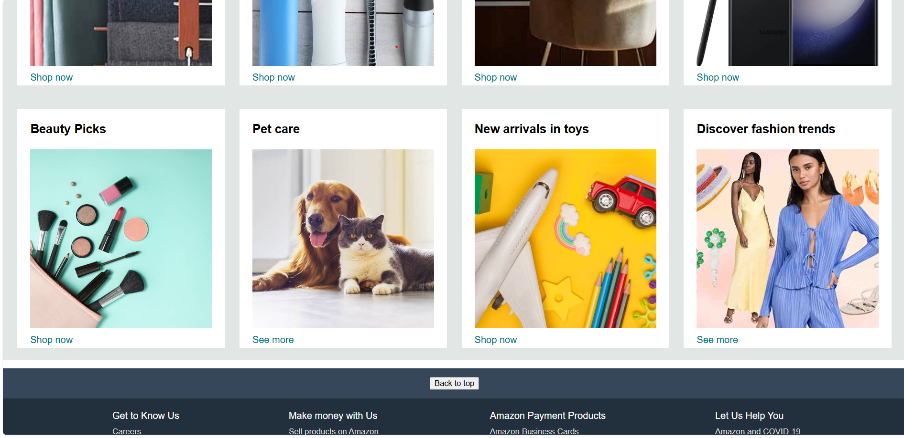

# amazon-clone
# 🛒 Amazon Clone

A pixel-inspired front-end clone of Amazon's homepage, built from scratch using **HTML** and **CSS**.

## 📌 About

This project recreates the look and feel of Amazon's homepage — navbar, search bar, delivery panel, category shop section, and footer — as a way to practice real-world layout techniques using Flexbox and responsive design principles.

## ✨ Features

- 🧭 Sticky navbar with logo, delivery location, search bar, sign-in, and cart icons
- 📦 Category shop section with 8 product cards (Clothing, Electronics, Beauty, and more)
- 🦶 Multi-panel footer inspired by Amazon's real footer structure
- 🎨 Amazon-accurate color palette and typography

## 🛠️ Built With

- HTML5
- CSS3 (Flexbox)
- [Font Awesome](https://fontawesome.com/) for icons

## 🚀 Getting Started

Clone the repo and open `Amazonclone.html` in your browser:

\`\`\`bash
git clone https://github.com/pavanharali018-dotcom/amazon-clone.git
cd amazon-clone
\`\`\`

Then just open `Amazonclone.html` directly in your browser — no build steps needed.

## 📸 Preview

## 🧭 Roadmap

- [ ] Add JavaScript interactivity (cart, dropdowns)
- [ ] Make layout responsive for mobile
- [ ] Add hover animations

## 🙋 Author

**Pavan** — learning web development & version control, one project at a time.

---

⭐ If you like this project, consider giving it a star!
## 📸 Preview

